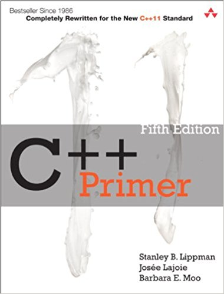

# cpp-solutions

My ongoing solutions to the exercises in "C++ Primer", 5th ed., by Lippman,
Lajoie and Moo.

## About

My exercises aim to be complete with minimal clutter and obfuscation. Sparse
comments will be added to code that is not easily understood and does not use
common idioms of which most C or C++ programmers would be aware.

All code was written and testing on a x64\_86 Linux system, running the GNU
`g++` compiler set to the C++11 standard, unless otherwise indicated.

## Purpose

The purpose of this repository is not only to track my personal progress with
the exercises contained in "C++ Primer" but also to attempt to aid other
learners who struggle with a particular exercise. If there is any errors or
mistakes in this repository, please notify me, and I will try to fix them.

## License

Code from the book has the copyright notice as stated in `book-notice.txt`.
